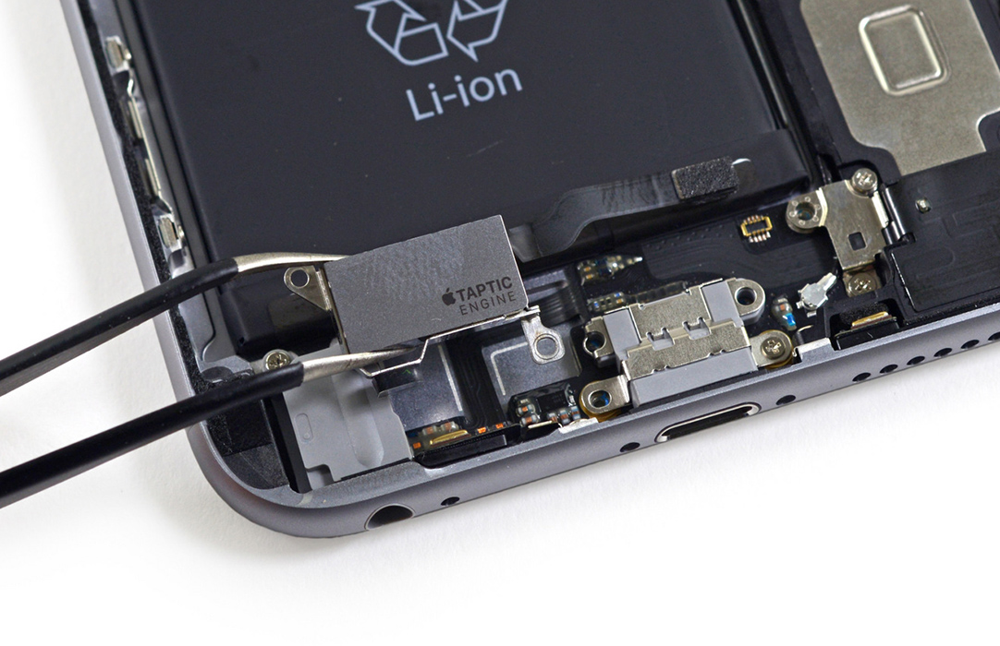

# NativeScript Taptic Engine plugin

> __BEWARE__ This plugin uses an undocumented feature which may get your app rejected when reviewed by Apple. Once Apple releases an official API this plugin will be updated of course. [People have used this approach __without problems__ though.](http://stackoverflow.com/questions/32526868/taptic-in-ios-9)




### Supported platforms
* iPhone 6s / 6s Plus or newer

## Installation
From the command prompt go to your app's root folder and execute:

```
tns plugin add nativescript-taptic-engine
```

## Demo app
Want to dive in quickly? Check out [the demo app](demo)! Otherwise, continue reading.

You can run the demo app from the root of the project by typing `npm run demo.ios.device`.

## API

### `weakBoom`
This triggers the same effect as the 'Peek' in 'Peek & Pop', a very brief vibration.

##### JavaScript
```js
// require the plugin
var TapticEngine = require("nativescript-taptic-engine").TapticEngine;

// instantiate the plugin
var tapticEngine = new TapticEngine();

tapticEngine.weakBoom().then(
  function() {
    // note that unsupported iOS devices like the simulator also end up here, at the moment
    console.log("Boomed weakly, if available.");
  }, function () {
    console.log("You're running on Android. Meh.");
  }
);
```

##### TypeScript
```js
// require the plugin
import {TapticEngine} from "nativescript-taptic-engine";

// instantiate the plugin
let tapticEngine = new TapticEngine();

tapticEngine.weakBoom().then(() => {
  // note that unsupported iOS devices like the simulator also end up here, at the moment
}, (err) => {
  console.log("You're running on Android. Meh.");
});
```

### `strongBoom`
This triggers the 'Pop' effect of 'Peek & Pop', which is a bit more profound than the 'Peek' effect.

Codewise this is exactly the same as `weakBoom`, except for the function name of course.


### `burst`
This triggers the 'Nope' effect you get when fi. force touching a home icon which doesn't have any action. It's a short burst of 3-ish 'weak booms'.

Codewise this is exactly the same as `weakBoom` and `strongBoom`, except for the function name of course.

## Changelog
* 1.0.0  Initial release

## Future work
* Implement the official API. If any. Ever.